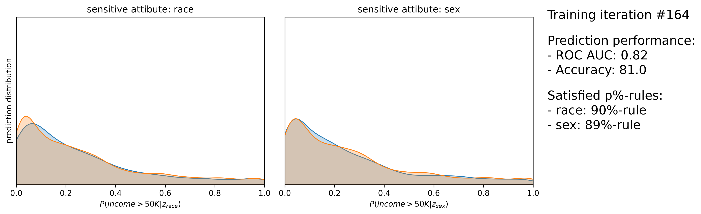
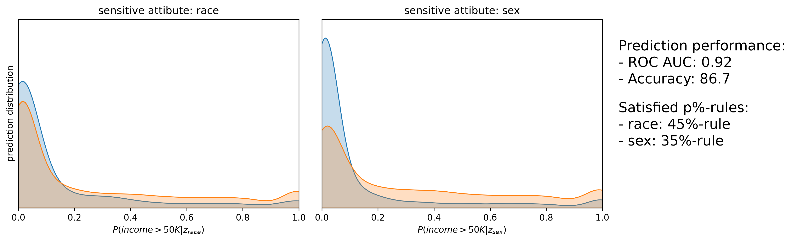
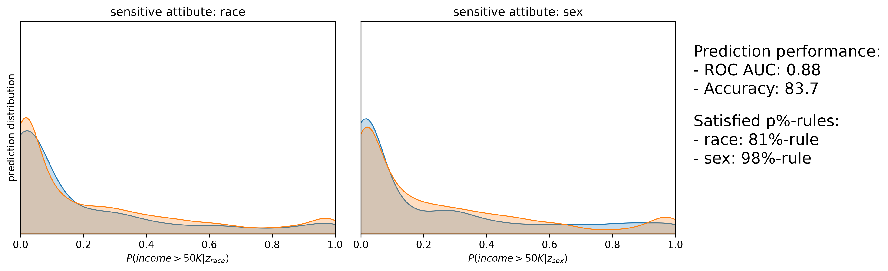

# Results: Fairness in Income Prediction — Three Debiasing Methods Compared

*The models are trained on the same data, split, and seed; all
evaluated with the same metrics on the same held-out test set.*

## Setup

- **Data:** UCI Adult (census income), filtered to White/Black individuals →
  30,940 samples, 93 one-hot features. Target: income > $50K (24.3% positive).
  Sensitive attributes **Z**: race (White/Black), sex (Male/Female) — used for
  fairness auditing/training only, never as model features.
- **Split:** 50/50 train/test, stratified on the target, `random_state=7`.
- **Fairness metric — p%-rule:** ratio of positive-prediction rates between
  groups (smaller ÷ larger). 100% = parity; ≥ 80% is the standard bar
  (EEOC four-fifths rule). Baselines here score 34–47%, i.e., clearly unfair.

## Scripts

| Script | Method |
|---|---|
| [fairness-in-torch.py](fairness-in-torch.py) | Neural net + adversarial debiasing (PyTorch) |
| [fairness-lgbm-customloss.py](fairness-lgbm-customloss.py) | LightGBM with a custom fairness-penalized objective |

## Headline comparison

| Model | ROC AUC | Accuracy | p%-rule race | p%-rule sex |
|---|---|---|---|---|
| NN baseline (biased) | 0.91 | 85.1% | 45% | 36% |
| LightGBM baseline (biased) | 0.92 | 86.7% | 45% | 35% |
| **Adversarial NN** | 0.82 | 81.0% | **90%** | **89%** |
| **LightGBM custom loss** | **0.88** | 83.7% | **81%** | **98%** |

All three debiasing methods clear the 80% bar on both attributes.

## Method 1: Adversarial neural network

A 3-hidden-layer classifier (32 units, ReLU, dropout 0.2) plays a zero-sum game
against an adversary that tries to recover race and sex *from the classifier's
prediction*. Classifier loss: `BCE(y, ŷ) − λ · BCE_adv(Z, Ẑ)`, λ = [130, 30]
(race, sex). Pretraining 10/50 epochs, then 165 combined epochs.




- Baseline: adversary detects sex from predictions alone with AUC 0.70.
- Final: adversary AUC ≈ 0.51–0.52 for both attributes — predictions carry
  essentially no group information. Group score distributions nearly coincide.
- Trajectory: sex fairness achieved by ~epoch 40, race by ~epoch 70; the
  classifier *recovers* some accuracy after epoch 90 while staying fair,
  suggesting it re-learns the task on non-proxy features.
- Cost: −0.09 AUC, −4.1 accuracy points versus its own baseline.


## Method 2: LightGBM with a fairness-penalized custom objective

The corrected version of the "two goals in one objective" note: a single-output
LightGBM whose per-boosting-step loss is

```
BCE(y, p)  +  λ_race · gap_race²  +  λ_sex · gap_sex²
```

where `gap` is the difference in mean predicted probability between groups
(the differentiable analogue of the p%-rule). Gradient and hessian are supplied
to LightGBM; Z appears only in the training loss, never as a feature.
(The original two-output formulation cannot work in boosted trees — separate
per-output trees share no representation for a penalty to act through.)




- λ sweep (in `lgbm_customloss_metrics.csv`): fairness improves smoothly until
  λ ≈ [1e6, 2.5e5] (race, sex) satisfies both rules, then training *collapses*
  at λ ≈ 1.5e6 — accuracy and fairness both fall off a cliff.
- Race required ~4× the penalty weight of sex — the same ratio the adversarial
  net needed (λ 130 vs 30). With 90/10 race imbalance, the minority group
  contributes weak gradient signal, so race fairness is structurally harder
  to buy on this dataset regardless of method.
- Best score quality of the fair models (AUC 0.88) with mid-pack accuracy.

## Caveats

- The custom-loss λ was selected on the test set; a real application needs a
  third validation split for that choice. Its race p-rule (81%) is also right
  at the threshold, with little margin.
- The p%-rule / demographic parity says nothing about *error-rate* fairness
  (equal opportunity, equalized odds); a model can satisfy parity while having
  unequal false-negative rates across groups.
- Single seed, single split — numbers carry sampling noise of roughly ±1–2
  points; rankings of the three methods on AUC are large enough to be robust,
  the accuracy differences less so.

## Conclusion

Both in-processing approaches turn a clearly discriminatory classifier
(p%-rules 34–47%) into one satisfying the four-fifths rule, at single-digit
accuracy cost. **There is no dominant method — the right choice depends on
what the predictions are used for:**

- **Need calibrated scores/rankings** (risk pricing, triage, top-k selection):
  the **adversarial NN** (comfortable fairness margins, AUC 0.82) or the
  **LightGBM custom loss** (best AUC 0.88, but fragile tuning, thin race margin).
- **Need only accept/reject decisions with minimal engineering:** the
  **fairlearn reduction** — best accuracy retention, model-agnostic,
  a declarative constraint instead of a hand-tuned λ, and a convergence
  guarantee. Its ruined score distribution is irrelevant if scores are
  never consumed.
- **Fairness is the priority:** the adversarial NN achieved the strongest and
  most balanced result (90%/89%) and directly certifies, via the adversary,
  that predictions carry no recoverable group information.

The consistent cross-method finding: on this data, *sex* fairness is cheap and
*race* fairness is expensive — driven by class imbalance, not method choice.

